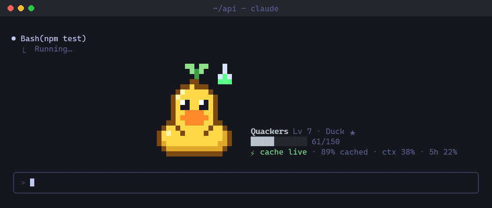
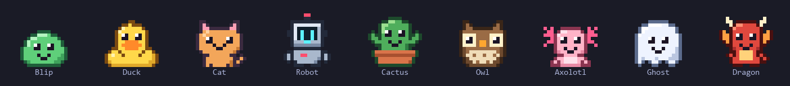
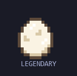
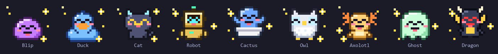
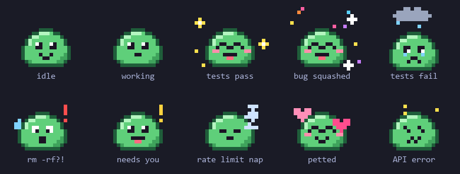
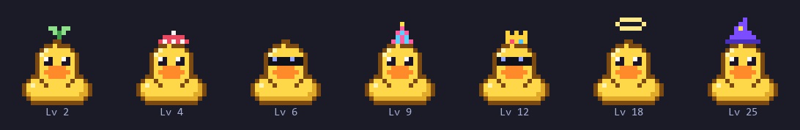
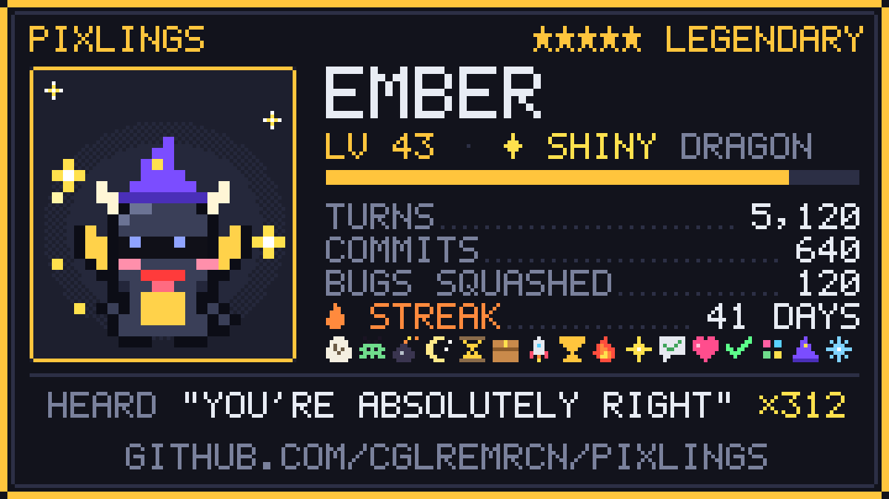

<p align="center">
  
</p>

# Pixlings

A tiny pixel creature that lives above your Claude Code prompt and keeps an eye on the things Claude Code doesn't show you.

- **Your prompt cache, counted down.** Each message re-reads the conversation from Anthropic's prompt cache at a tenth of the normal input price. After five minutes of silence (an hour, if your setup uses the longer cache) the cache is gone, and the next message writes the whole context again at 1.25× (2× for the hour-long cache). On a 150k-token conversation that one message costs about twelve times more. Pixlings shows the countdown, and a minute before it runs out your pixling taps the glass.
- **It wakes Claude when your limit resets.** Hit your usage limit and it naps with a countdown. When the window resets it wakes up and tells Claude to carry on, so a long task finishes while you sleep.
- **Sound and notifications on every OS.** It calls you when Claude needs permission or finishes a long turn, with a chiptune ping and a desktop notification. The Mods sound API only plays on macOS, so Pixlings brings its own players for Windows and Linux.
- **It yelps before risky commands run.** `rm -rf`, `git push --force`, `git reset --hard`, `DROP TABLE`, `curl … | sh` and friends.
- **It hears everything.** Every "You're absolutely right" gets an eye roll and goes on the tally.

## Install

Needs Claude Code 2.1.287 or newer, the first version with mods.

```sh
claude plugin marketplace add cglremrcn/pixlings
claude plugin install pixlings@pixlings
```

Start a new Claude Code session and an egg hatches. Every setting has a default, so there is nothing to configure.

## Meet yours

<p align="center"></p>

Nine species in five rarities, from a common blip (50%) to a legendary dragon (1.5%). One egg in 64 hatches shiny.

<p align="center">
  
  
</p>

It reacts to the session: tests, commits, pushes, pull requests, risky commands, permission prompts, API errors, rate limits. It dozes after fifteen minutes on its own and is glad when you come back.

<p align="center"></p>

Turning a failing test suite green counts as squashing a bug. While Claude works, the spinner talks like your pixling (*Quacking…*, *Haunting…*, *Compiling feelings…*), and when Claude is idle it wanders along the free space of the band.

It levels up as you work, and unlocks things to wear:

<p align="center"></p>

## The vitals row

Under its name sits one line:

```
⏳ cache 4:12 · 92% cached · ctx 41% · 5h 23%
```

| Piece | What it tells you |
|---|---|
| `⏳ cache 4:12` | Time until the prompt cache expires. `⚡ cache live` while Claude is working, `❄ cache cold` once it has expired. It turns yellow, then red in the last minute. |
| `92% cached` | How much of this session's input was served from the cache. |
| `ctx 41%` | How full the context window is. |
| `5h 23%` | Your rate-limit windows (five-hour and weekly). |

Claude Code doesn't expose the cache lifetime, so Pixlings works it out from each request's token counts. It starts by assuming five minutes, shown with a `~`. If a request after a longer pause still hits the cache, it knows you have the hour and remembers that. When you come back to a cold cache it tells you how many tokens were written again, and counts it.

## Trading cards

`/pixling share` draws a card, saves it to your home folder as `pixling-<name>.png`, opens it, and puts a post on your clipboard.

<p align="center"></p>

## Badges, streaks and the morning recap

Sixteen badges, each earned once: **Exterminator** for squashing 10 bugs, **Night Owl** for 25 turns after midnight, **Brain Freeze** for letting the cache go cold 10 times, **Absolutely Right** for hearing it 25 times, **On Fire** for a 7-day streak, **Liftoff** for your first pull request, and ten more. `/pixling badges` lists them all with how far along you are.

It counts the days in a row you show up, and the first session of the day opens with yesterday: *Yesterday: 41 turns · 6 commits · 2 bugs squashed · +212 XP*.

## Commands

| Command | |
|---|---|
| `/pixling` | Its card: stats, badges, what it has heard, the cache |
| `/pixling share` | Save a trading card and copy a post to go with it |
| `/pixling badges` | Every badge, earned or not, with progress |
| `/pixling pet` | ♥ |
| `/pixling name <name>` | Rename it |
| `/pixling wear [item]` | Show the wardrobe, or put something on (`none` to take it all off) |
| `/pixling dex` | The species you have hatched so far |
| `/pixling hatch` | Release it and hatch a new egg. Level and stats start over; the dex stays. |

## Settings

All in `/config`, under Pixlings.

| Setting | Values | Default |
|---|---|---|
| `sound` | `all`, `important` (when Claude needs you, a long turn ends, a dangerous command runs or the limit hits), `off` | `all` |
| `voice` | `animalese` (a made-up syllable per letter at the species' pitch), `speech` (the system voice reads the line), `off` | `animalese` |
| `band` | `full`, `minimal` (one line: face, name, cache countdown), `off` | `full` |
| `chatter` | `normal`, `quiet` (only failures, danger and when it needs you) | `normal` |
| `notifications` | Desktop notifications | on |
| `autoContinue` | Tell Claude to continue when the usage limit resets | on |
| `vitals` | The vitals row | on |
| `cacheWarning` | The one-minute cache warning | on |
| `cacheTtl` | `auto`, `5m`, `1h` | `auto` |
| `roam` | Walk around when Claude is idle | on |

## Questions

**Does it eat my context?** No. Nothing it draws, plays or tracks goes into Claude's prompt, and it never calls the model. `claude plugin details pixlings@pixlings` reports about 0 always-on tokens. Two small exceptions: what a `/pixling` command prints lands in the transcript like any command output (a few tokens, about 450 for `/pixling badges`), and auto-continue sends one short prompt after a limit reset.

**Is it heavy?** Drawing a frame takes about 0.04 ms, ten times a second. Each sound plays in a short-lived process; on Windows that is a PowerShell that lives for about a second.

**Does it send anything anywhere?** No. It makes no network requests. Its save lives in Claude Code's plugin store on your machine.

**I want the useful parts, not the creature.** Set `band` to `minimal` for a single line with the cache countdown, or `off` to hide it. Sounds, notifications, the risky-command alarm and auto-continue keep working.

**It's too much.** `chatter: quiet`, `sound: important`, `voice: off`, `roam: off`.

**Where does the card go?** Your home folder: `%USERPROFILE%` on Windows, `~` elsewhere.

## How it's made

It's a Claude Code mod written in TypeScript. The sprites are 16×16 palette grids composed into a small canvas and sent to the terminal as half-block characters, two pixels per cell, about ten frames a second. On the desktop app and VS Code it draws an SVG instead. The event sounds are generated from scratch by [`tools/synth.py`](tools/synth.py). The voice is synthesized for each line, from harmonics shaped by vowel formants. The share card is a PNG encoded inside the mod, with its own 5×7 pixel font and its own deflate.

The creature in every image here is drawn by the plugin's own code, frame by frame; the terminal around it in the top GIF is painted by [`tools/make_hero.py`](tools/make_hero.py). The scripts are in [`tools/`](tools). To run the tests:

```sh
claude plugin test plugins/pixlings
```

## License

MIT
